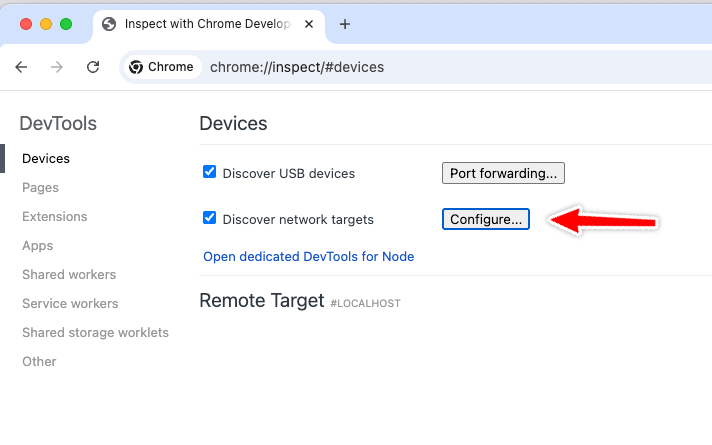
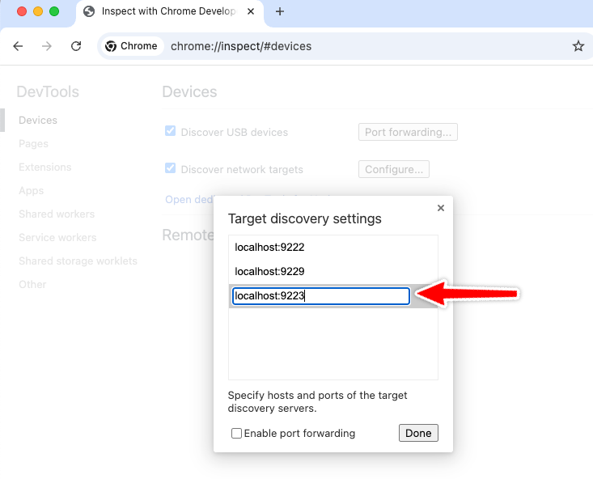
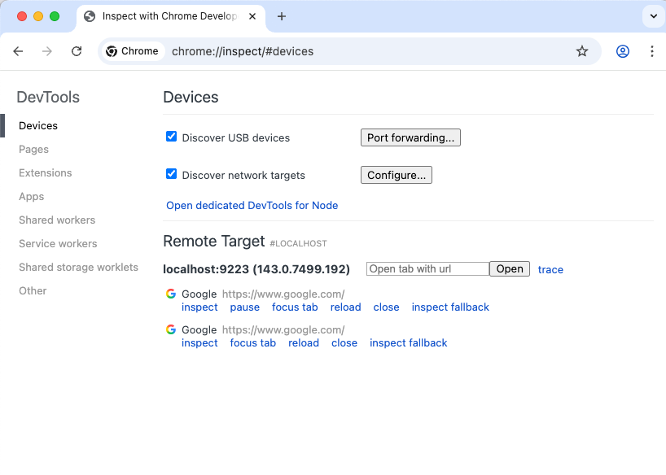

# Chromium Kiosk + VNC Docker 環境（繁體中文 + CDP）

## 功能特點

- ✅ **Chromium Kiosk 模式** - 全屏顯示，適合數位看板與自動化展示
- ✅ **自動重啟機制** - Chromium 關閉後自動重啟，確保服務持續運行
- ✅ **Chrome DevTools Protocol (CDP)** - 支援 Playwright/Puppeteer 自動化
- ✅ **VNC 遠端桌面** - 可遠程查看與管理（TigerVNC + XFCE4）
- ✅ **繁體中文支援** - 完整中文字體與輸入法
- ✅ **進程監控** - VNC 關閉時自動停止容器


## 使用 Chrome 驗證連線到遠端瀏覽器方法.

> `chrome://inspect` 添加遠端分頁








## 快速開始

### 使用 Docker Compose（推薦）

```bash
# 建置並啟動
docker compose up -d --build

# 查看 log
docker compose logs -f

# 停止
docker compose down
```

### 使用 Docker 指令

```bash
# 建置 image
docker build -t chromium-vnc .

# 啟動容器
docker run -d \
  --name chromium-vnc \
  -p 5901:5901 \
  --shm-size=2g \
  --security-opt seccomp=unconfined \
  chromium-vnc
```

## 連線方式

### Chrome DevTools Protocol (CDP)

容器啟動後，Chromium Kiosk 模式會自動開啟並監聽 CDP：

- **內部 WebSocket**: `ws://127.0.0.1:9222`
- **外部 WebSocket**: `ws://localhost:9223` ⭐
- **HTTP API**: `http://localhost:9223/json`

> **注意**: 使用 port `9223` 連接容器外部的 CDP。

#### 常用 CDP Endpoints

```bash
# 取得所有可用的 targets（分頁）
curl http://localhost:9223/json

# 取得版本資訊
curl http://localhost:9223/json/version

# 開啟新分頁
curl http://localhost:9223/json/new?http://example.com

# 關閉分頁
curl http://localhost:9223/json/close/{targetId}
```

#### Playwright 連線範例

```javascript
const { chromium } = require('playwright');

// 連接到 Kiosk 模式的 Chromium
const browser = await chromium.connectOverCDP('http://localhost:9223');

// 取得現有分頁或建立新分頁
const context = browser.contexts()[0];
const page = context.pages()[0] || await context.newPage();

// 自動化操作
await page.goto('https://example.com');
console.log(await page.title());

// 保持連接，不關閉瀏覽器
// await browser.close();
```

#### Puppeteer 連線範例

```javascript
const puppeteer = require('puppeteer');

const browser = await puppeteer.connect({
  browserURL: 'http://localhost:9223'
});

const page = await browser.newPage();
await page.goto('https://example.com');
```

### VNC 連線資訊

- **位址**: `your-ip:5901`
- **密碼**: `password`

### VNC 客戶端推薦

- **macOS**: 內建「螢幕共享」或 [RealVNC Viewer](https://www.realvnc.com/en/connect/download/viewer/)
- **Windows**: [RealVNC Viewer](https://www.realvnc.com/en/connect/download/viewer/) 或 [TigerVNC](https://tigervnc.org/)
- **Linux**: Remmina、TigerVNC Viewer

### macOS 快速連線

```bash
open vnc://localhost:5901
```

## 自訂設定

### 修改 VNC 密碼

編輯 Dockerfile 中的：
```dockerfile
echo "your-new-password" | vncpasswd -f > /home/user/.vnc/passwd
```

### 修改解析度

編輯 Dockerfile 中的啟動腳本：
```dockerfile
vncserver :1 -geometry 1920x1080 -depth 24 -localhost no
```

常用解析度：
- `1920x1080` (Full HD) - 預設
- `2560x1440` (2K)
- `3840x2160` (4K)
- `1280x720` (HD)

### 關閉 Kiosk 模式

如需正常瀏覽器模式（非全屏），編輯 Dockerfile 中的 `chromium-cdp` 腳本，移除 `--kiosk` 參數：

```dockerfile
chromium \
    --remote-debugging-port=9222 \
    --remote-debugging-address=0.0.0.0 \
    ...
    # 移除這行 --> --kiosk \
```

### 調整自動重啟行為

預設情況下：
- **Chromium 關閉** → 自動重啟（5 秒後）
- **VNC 關閉** → 停止容器

如需修改行為，編輯 Dockerfile 中的 `/start.sh` 腳本。

### 掛載本機目錄

取消 `docker-compose.yml` 中的註解：
```yaml
volumes:
  - ./downloads:/home/user/Downloads
```

## 使用中文輸入法

1. 連線 VNC 後，開啟終端機
2. 執行 `ibus-setup` 設定輸入法
3. 在 Input Method 中加入 Chewing（酷音）
4. 使用 `Ctrl+Space` 切換輸入法

## 疑難排解

### 檢查容器狀態

```bash
# 查看容器日誌（包含 Kiosk 啟動資訊）
docker logs chromium-vnc

# 即時追蹤日誌
docker logs -f chromium-vnc
```

正常啟動會看到：
```
===========================================
  Chromium Kiosk Mode + VNC + CDP
===========================================
VNC Server 已啟動在 port 5901 (PID: 15)
預設密碼: password

[18:53:07] 啟動 Chromium Kiosk...

Chrome DevTools Protocol 已啟動 (PID: 229)
WebSocket (internal): ws://127.0.0.1:9222
WebSocket (external): ws://your-ip:9223
HTTP: http://your-ip:9223/json

監控進程: VNC(15), Chromium(229), socat(227)
Kiosk 模式：Chromium 關閉後將自動重啟
===========================================
```

### Chromium 無法啟動

確保使用了 `--shm-size=2g` 參數，Chromium 需要較大的共享記憶體。

### 中文顯示亂碼

確認語系環境變數已正確設定：
```bash
docker exec chromium-vnc locale
```

### VNC 連線失敗

檢查容器 log：
```bash
docker logs chromium-vnc
```

## 檔案結構

```
chromium-docker/
├── Dockerfile           # Docker 映像定義（含啟動腳本）
├── docker-compose.yml   # Docker Compose 設定
├── start.sh            # 本地啟動腳本（開發用）
└── README.md           # 說明文件
```

## Kiosk 模式行為

| 事件 | 行為 |
|------|------|
| Chromium 關閉 | 5 秒後自動重啟 |
| VNC 關閉 | 容器停止 |
| 容器重啟 | 服務自動恢復 |

## 使用場景

- **數位看板** - 全屏循環顯示網頁內容
- **自動化展示** - 搭配 Playwright 進行自動化操作演示
- **自助服務終端** - Kiosk 模式提供受控瀏覽體驗
- **遠程監控** - 通過 VNC 查看畫面，通過 CDP 控制瀏覽器
